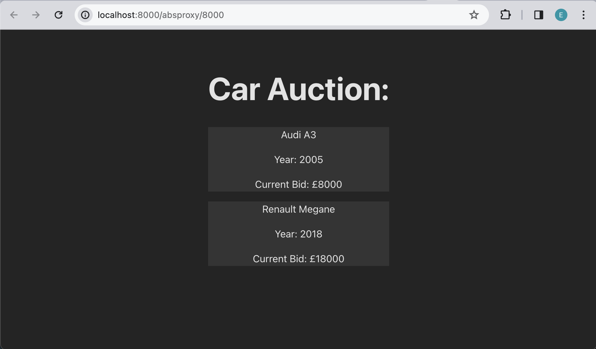

# React - Introduction to Components and Props

## Setup 
Before we begin writing code, let's setup the project and install all necesarry packages.
Open a new Terminal window and do the following steps:

1. Go to `calab` directory:
    ```
    cd calab
    ```
2. Install npm packages:
    ```
    npm install
    ```
3. Start the application:
    ```
    npm run dev
    ```
    You should see the development server being started:
    []() 

    If you open the `Local` URL in a new browser tab, you should see the follwoing:
    []()    


## Steps 

1. Create component called `Car`.
-   Change direcory to `calab/src`.
-   Create a new directory inside `src` called `componets`.
-   Create a new file inside `componets` called `Car.jsx`.
-   Add the following code to the `Car.jsx`:
    ```
    function Car() {
        return (
            <div>
                <p>Volkswagen Golf</p>
                <p>Year: 2015</p>
                <p>Current Bid: £11000</p>
            </div>
        )
    }
    export default Car
    ```

2. Import newly created `Car.jsx` component to `App.js`.
-   Open `App.js`.
-   Replace text inside `<h1>` element to `Car Auction:`.
-   Import newly created component `Car.jsx` to `App.jsx`. Above the app() function import `Car` from `'./components/Car'`
-   Now that Car component is imported, let's use it. After the `<h1>` element, let's insert the car by creating `<Car/>`.
-   Add another car `<Car/>`.

3. Add some Style the `Car.jsx`.
- Create a new directory inside `componets` called `css`.
- Create a new file inside `css` called `Car.css`.
- Open `Car.css` and add the folowing css class:
  ```
  .background{
      background-color:  #343434;
  }
  ```
- Open `Car.jsx` file and:
  - import `Car.css` file
  - add the CSS class called `background`
    ```
    <div className='background'>
    ```

4. Send props to `Car.jsx`:
-  Open `App.jsx` and update `Car` elements with following props:
    ```
    <Car make='Audi' model='A3' year='2005' bid='8000'/>
    <Car make='Renault' model='Megane' year='2018' bid='18000'/>
    ```
-   Open `Car.jsx` and use the props that were sent from `App.jsx`
    - Add `props` argument to the Car component.
    ```
    function Car(props)
    ```
    - In order to access `props`, let's use a JSX expression. Replace the following words with coresponding props:
    `Volkswagen` - `{props.make}`,
    `Golf` - `{props.model}`,
    `2015` - `{props.year}`,
    `11000` - `{props.bid}`.

If you followed the steps correctly you should see the following when you run your react application:
[]()  

